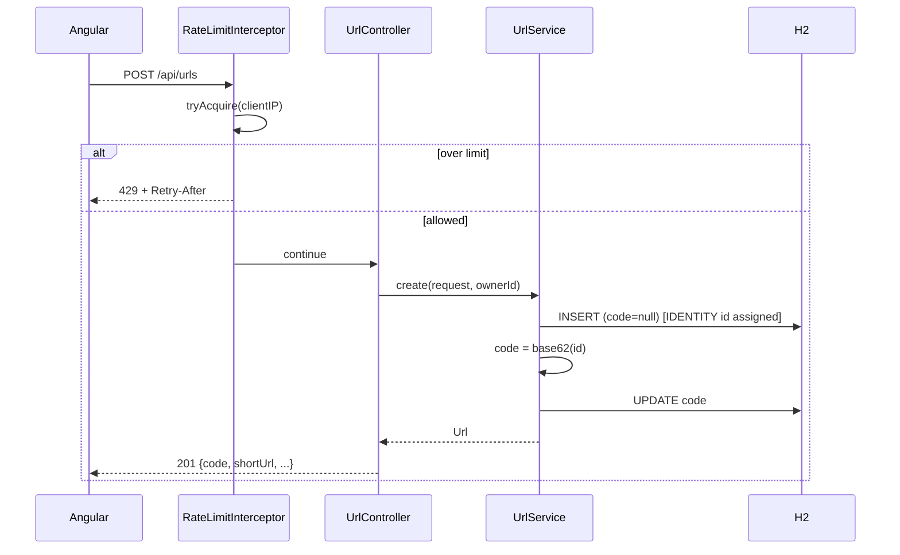
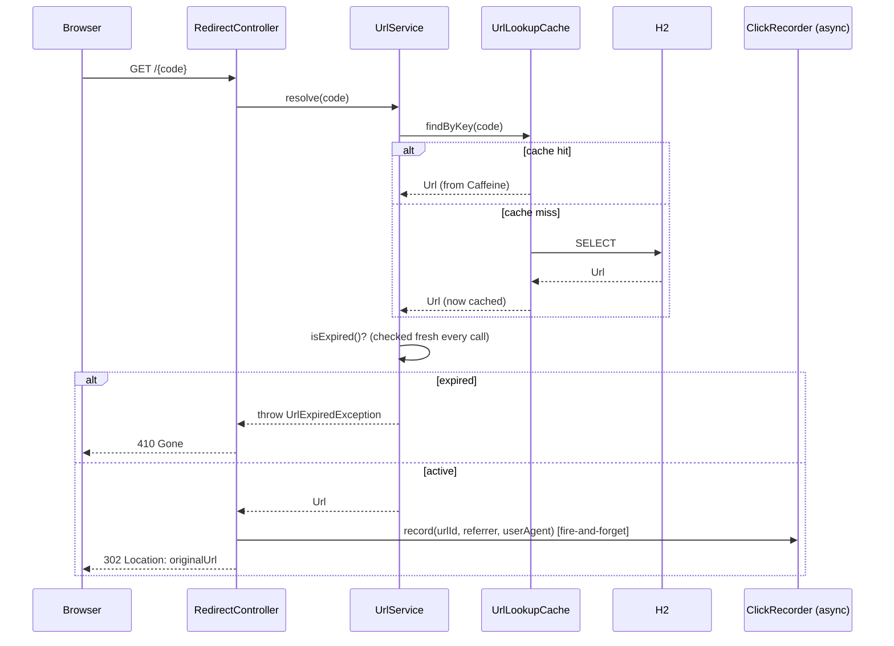
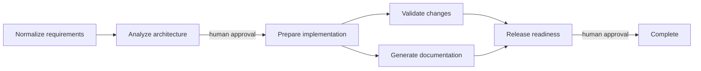

# Architecture Overview

## Components

```mermaid
flowchart LR
    subgraph Browser
        A[Angular SPA :4200]
    end

    subgraph Backend[Spring Boot :8080]
        C[UrlController /api/urls]
        R[RedirectController /:code]
        S[UrlService]
        ST[StatsService]
        CACHE[(Caffeine cache\nurlLookup)]
        RL[RateLimiter\nper-IP token bucket]
        CR[ClickRecorder\n@Async]
        JOB[ExpiredUrlCleanupJob\n@Scheduled]
    end

    DB[(H2 file DB\nFlyway-migrated)]

    A -- "POST /api/urls\nGET /api/urls\nGET /api/urls/{code}/stats" --> C
    A -- "GET /{code} (top-level nav)" --> R
    C --> S
    C --> ST
    R --> S
    R --> CR
    S --> CACHE
    CACHE --> DB
    S --> DB
    ST --> DB
    CR --> DB
    JOB --> DB
    C -. rate-limited by .- RL
```

- **UrlController** (`/api/urls`) — create, get metadata, list-by-owner, get stats.
- **RedirectController** (`/{code}`) — the hot path: resolve + 302, fires click recording async.
- **UrlService** — creation (code assignment), resolution (cache + expiry check).
- **StatsService** — click aggregation for the analytics endpoint.
- **UrlLookupCache** — the `@Cacheable` boundary in front of the DB lookup used by redirects.
- **RateLimiter** / **RateLimitInterceptor** — per-IP token bucket guarding `POST /api/urls`.
- **ClickRecorder** — async click write, off the redirect request thread.
- **ExpiredUrlCleanupJob** — daily purge of long-expired rows (retention window, not immediate delete).
- **GlobalExceptionHandler** — single place mapping domain exceptions to HTTP status + JSON shape.
- **OrchestrationController / WorkflowOrchestrator** — persisted SDLC run snapshots, dependency-ready
    waves, human approval gates, replan/safe-stop/rollback controls, and reliability metrics.
- **WorkflowAgent** — adapter boundary for stage workers. The included deterministic implementation
    produces reviewable demo artifacts without external model calls or source-tree writes.

## Request flow: create



The two-step insert-then-update exists because the short code is derived from the row's own
auto-increment id — it can't be known before the `INSERT` happens. Both statements run in one
`@Transactional` method, so a caller never observes a row with a null code.

## Request flow: redirect



Expiry is deliberately checked **outside** the cached method, against whatever `expiresAt` the
cached entity carries — so a link can't keep redirecting past its expiry just because it's still
within the cache TTL (see [`docs/SCENARIOS.md`](SCENARIOS.md), Scenario 3).

## Key decisions

| Decision | Rationale |
|---|---|
| Base62(auto-increment id) short codes | Collision-free by construction — no retry-on-collision loop needed, unlike random-code generation. Custom aliases still go through a DB unique constraint + 409. |
| Click recording is `@Async` on a dedicated bounded pool | Redirect latency must not depend on an analytics write. Trade-off: a click can be lost on a crash between response and write (eventual consistency, not exactly-once). |
| Cache only the raw DB lookup, not the expiry decision | Keeps hot-path DB load low without letting the cache TTL delay expiry enforcement. |
| Rate limiter and cache are in-process | Zero extra infrastructure for a prototype; documented as single-node-only — a multi-instance deployment needs Redis-backed versions of both. |
| `X-Owner-Id` client-generated pseudo-identity | Lets the dashboard scope "my links" without building real auth for a 2–3 day prototype. Explicitly not a security boundary. |
| H2 file DB + Flyway | Zero-infra local run; migrations mean swapping to Postgres is a config change, not a rewrite. |
| Redirect lives on the backend root path (`/{code}`) | Matches how a real short-link service is deployed (redirect on the short domain). In dev, frontend (`:4200`) and backend (`:8080`) are separate processes, so there's no path collision with Angular's routes; a production deployment serving the Angular build from the same origin as the API would need to reserve `/urls`, `/stats/*`, etc. before the catch-all redirect route, or put the redirect on its own subdomain. |

## Control flow / execution approach

Built as three sequential passes over one codebase (not three separate demos) — see
[`docs/SCENARIOS.md`](SCENARIOS.md) for the full decomposition, execution, and validation of each:

1. **Greenfield** — core create/redirect, from an empty repo.
2. **Brownfield** — analytics layered onto the working greenfield code (touches `RedirectController`, adds new tables/services/endpoints).
3. **Ambiguous** — a vague reliability/abuse requirement, normalized into concrete acceptance criteria, then implemented as rate limiting, caching, expiry enforcement, and input hardening on top of both prior passes.

Each pass was compiled, unit-tested, integration-tested, and manually smoke-tested via curl before
moving to the next, so later passes never built on unverified code.

## Governed workflow control flow

The Workflow Lab at `/orchestrator` drives a persisted run through this task graph:



Each advance request executes one dependency-ready wave. The test and documentation workers run
concurrently and must both finish before release readiness becomes approvable. Requirements are
length-limited and checked for likely secrets before persistence. Every transition appends an event
with actor, timestamp, task, and plan revision. Replanning increments the revision, rebuilds tasks,
and retains prior events. Safe stop takes effect between waves; rollback withdraws generated demo
artifacts while preserving the event history.

Workflow state and events are stored in the same H2 database as the shortener. Metrics expose
completed-run success rate, retry and rollback counts/rates, recovery time after safe-stop/failure,
and average terminal end-to-end latency. This is demonstrable traceability, not a tamper-proof
audit system: reviewer identity is not authenticated, storage is single-node H2, and workers are
deterministic adapters rather than an LLM-backed agent pool.
